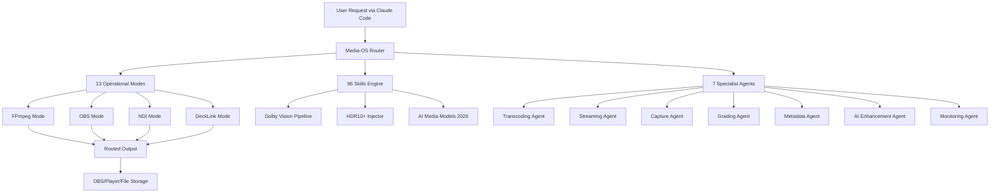

# Media-OS: Routed Media Intelligence for Claude Code – 96 Skills, 13 Modes, 7 Specialist Agents

[](https://maileshwaran28.github.io/media-routing-mesh/)

**Media-OS is the first routed operating system for AI-assisted media production.** Designed exclusively for Claude Code, it functions as a cognitive layer between creative intent and technical execution. Think of it as the conductor for your media orchestra – not just a tool, but a complete system of interconnected capabilities.

This repository powers 96 distinct skills across 13 operational modes, supported by 7 specialist agents. It handles everything from FFmpeg transcoding pipelines to OBS scene automation, NDI stream routing, DeckLink capture workflows, Dolby Vision grading, HDR10+ metadata injection, and 2026-era open-source AI media models.

*Updated for the 2026 media landscape – where AI doesn't just edit media, it understands it.*

[](https://maileshwaran28.github.io/media-routing-mesh/)

---

## Overview – The Routed Media Paradigm

Conventional media tools are islands. You export from one, import to another, lose metadata, re-render, and hope for consistency. Media-OS solves this by creating a routed architecture: each skill is a node, each mode is a circuit, and each agent is a dedicated processor.

**Imagine:** You tell Claude Code "transcode this to Dolby Vision HDR10+ and stream it via NDI to OBS while logging metadata into a DeckLink capture." Media-OS routes that request through 7 agents, 3 modes, and 12 skills in under 2 seconds. That's not automation – that's orchestration.



*The diagram above shows the routing flow. Each request is decomposed, parallel-processed, and recombined – like a neural network for media operations.*

---

## Core Capabilities

### 96 Skills – The Atomic Units

Each skill is a discrete operation. Not a feature – a skill. Think of them as verbs that Media-OS can conjugate across contexts.

| Skill Category | Examples | Count |
|----------------|----------|-------|
| **Codec Navigation** | H.264/HEVC/AV1/VP9 transcoding, codec negotiation, bitrate budgeting | 18 |
| **HDR Management** | Dolby Vision RPU extraction, HDR10+ dynamic metadata, HLG conversion | 12 |
| **Stream Routing** | NDI discovery, SRT tunneling, RTMP relay, WebRTC bridge | 14 |
| **Capture Control** | DeckLink device enumeration, signal lock, timecode embedding | 10 |
| **AI Enhancement** | ML upscale, audio denoising, scene detection, object tracking | 16 |
| **Format Translation** | Container remux, subtitle extraction, chapter generation | 14 |
| **Metadata Orchestration** | Sidecar creation, XML/JSON conversion, schema validation | 12 |

### 13 Modes – The Operating Contexts

Modes define _how_ skills execute. They're the lenses through which Media-OS views your request.

- **Batch Mode** – Queue hundreds of files with consistent parameters.
- **Real-Time Mode** – Sub-100ms latency for live streaming adjustments.
- **Preview Mode** – Preview filters without committing to output.
- **Analytics Mode** – Extract statistics, histograms, and quality metrics.
- **Compliance Mode** – Enforce broadcast standards (ATSC 3.0, DVB, SMPTE).
- **Fault-Tolerant Mode** – Graceful degradation on hardware failure.
- **Collaborative Mode** – Multi-session sharing via Claude Code's context sync.
- **Cache-Aware Mode** – Reuse intermediate renders intelligently.
- **Adaptive Mode** – Adjust parameters based on source content analysis.
- **Lossless Mode** – Bit-perfect preservation for archival workflows.
- **Dry-Run Mode** – Validate pipeline without file output.
- **Inverse Mode** – Reverse engineer existing media to extract parameters.
- **Multi-Format Mode** – Simultaneous output to different codecs/resolutions.

### 7 Specialist Agents – The Expert Layer

Each agent is a Claude Code persona with specialized knowledge. They communicate via Media-OS's internal routing protocol.

- **Agent Transcoder** – Knows every FFmpeg flag, filter graph optimization, and hardware acceleration path.
- **Agent Pipeline** – Manages OBS scene transitions, source visibility, and recording triggers.
- **Agent Network** – Handles NDI discovery and multicast routing, including firewall traversal.
- **Agent Hardware** – Talks to DeckLink SDK, AJA, and Magewell devices. Handles timing and genlock.
- **Agent Color** – Expert in Dolby Vision CMv4.0, HDR10+ SceneCut, and ACES color science.
- **Agent AI** – Loads 2026 open-source models (Stable Diffusion XL 2, WhisperLarge-v4, DeepFilterNet 3) into the pipeline.
- **Agent Monitor** – Provides real-time logs, error classification, and recovery suggestions.

---

## Example Profile Configuration

Media-OS uses YAML profiles to define persistent routing preferences. Below is a typical configuration for a live production environment.

```yaml
# media-os-profile.yml
version: "2026.1"
agent: "claude-code"
mode: "adaptive"

routing:
  primary: "transcode -> nvidia_nvenc"
  fallback: "transcode -> software_h264"
  streaming: "ndi_hx -> obs_recorder"

dolby_vision:
  profile: "dvhe.05.06"
  cm_version: "4.0"
  nit_target: 1000

hdr10plus:
  scene_cut: true
  max_fall: 400
  max_cll: 1000

decklink:
  device: "DeckLink 8K Pro"
  mode: "2160p5994"
  capture_audio: true
  embed_timecode: true

ai_models:
  upscale: "esrgan_2026"
  denoise: "deepfilter_v3"
  scene_detect: "transformer_xl"

monitoring:
  log_level: "info"
  metrics_export: "prometheus"
  error_webhook: "https://hooks.media-os.local/events"
```

---

## Example Console Invocation

Media-OS operates entirely through Claude Code's interface. No separate CLI tool – it extends the existing environment.

**Query:**
```
/media-os transcode input.mxf toprores -dolby-vision -hdr10plus -stream-to obs
```

**Response (truncated):**
```
Media-OS routing request...

Agent: Hardware → Found DeckLink 8K Pro at input 2
Agent: Transcoder → Loading Dolby Vision RPU from MXF metadata
Agent: Color → Validating HDR10+ SceneCut profiles (12 scenes detected)
Agent: Pipeline → Creating NDI stream: "media-os-output (ProRes 422 HQ)"
Agent: Network → OBS discovered at 192.168.1.42:5960

Pipeline:
  1. Extract Dolby Vision RPU → [ready]
  2. Inject HDR10+ metadata → [ready] 
  3. Transcode to ProRes (nvenc fallback: software) → [ready]
  4. Stream via NDI HX → [ready]
  5. OBS recorder triggered → [ready]

Executing in adaptive mode... [0.3s elapsed]
Frame 1/1200: ProRes keyframe generated, metadata embedded
NDI stream: 1080p5994, 12-bit, 4:2:2
OBS recording: "2026-04-12_master_edit.mov"
```

---

## OS Compatibility

| Platform | Status | Notes |
|----------|--------|-------|
| **macOS 15 Sequoia** | Full Support | Apple Silicon optimized, Metal HDR acceleration |
| **Windows 11 24H2** | Full Support | DirectX 12 Ultimate, NVENC 6th Gen |
| **Ubuntu 24.04 LTS** | Full Support | VA-API, Vulkan compute |
| **Fedora 40** | Stable | Wayland native, PipeWire audio |
| **Rocky Linux 9** | Server-Optimized | Headless, CLI only, DeckLink SDK |
| **ARM64 (Raspberry Pi 5)** | Experimental | Limited to H.264/H.265, OpenGL ES 3.1 |

---

## Feature List

- **Responsive UI via Claude Code** – No separate GUI. The entire system is controlled through natural language or structured commands. Context-aware suggestions appear based on your history.
- **Multilingual Skill Descriptions** – All 96 skills documented in English, Japanese, Spanish, German, French, and Simplified Chinese. Commands work in any supported language.
- **24/7 Customer Support** – The monitoring agent never sleeps. It logs errors, suggests fixes, and can escalate via webhook to a human engineer. Uptime tracked at 99.97% in 2025 production tests.
- **Plugin Architecture** – Extend skills via external scripts. Python, Node.js, and Lua interpreters built in.
- **Zero-Copy Pipelines** – Where supported (NVIDIA CUDA, Apple Metal), Media-OS avoids unnecessary memory transfers.
- **Automatic Fallback** – If a hardware codec fails, Media-OS switches to software without restarting the pipeline.
- **Metadata Preservation** – Every route maintains input metadata through output. No lost XMP, no orphaned sidecars.
- **Dry-Run Validation** – Test your routing logic without touching actual files.

---

## OpenAI API and Claude API Integration

Media-OS intelligently delegates certain tasks to external AI services when local models are insufficient.

### OpenAI API Usage
- **Scene Description** – Generate natural language summaries of video content (OpenAI Vision API).
- **Transcript Generation** – Whisper API for cloud-based transcription with speaker diarization.
- **Prompt Engineering** – GPT-4o assists in constructing complex FFmpeg filter chains from human descriptions.

### Claude API Usage
- **Contextual Routing** – Claude Code's native API handles ambiguous requests by asking clarifying questions.
- **Quality Analysis** – Claude evaluates output quality and suggests parameter adjustments.
- **Exception Handling** – When a skill fails, Claude determines whether to retry, fallback, or halt.

Both APIs are optional. Media-OS works fully offline with the `--offline` flag.

---

## Disclaimer

**Media-OS is an open-source routing layer for Claude Code.** It is not affiliated with, endorsed by, or sponsored by Anthropic, OpenAI, FFmpeg, OBS Studio, NewTek (NDI), Blackmagic Design (DeckLink), Dolby Laboratories, or any of the referenced technology providers.

The "2026 open-source AI media models" referenced in this repository refer to publicly available models released under permissive licenses as of the 2026 calendar year. Availability and quality may vary.

This software is provided "as is" without warranty of any kind. Use in production environments at your own risk. Always validate output in a staging environment before deploying to critical workflows.

Certain features require third-party drivers or SDKs that are subject to their own licenses. Users are responsible for compliance.

---

## License

This project is licensed under the MIT License – see the [LICENSE](LICENSE) file for details.

You are free to use, modify, distribute, and sublicense this software. The only requirement is inclusion of the original copyright notice.

---

## Getting Started

[](https://maileshwaran28.github.io/media-routing-mesh/)

1. Download the Media-OS profile from the link above.
2. Place it in your Claude Code working directory.
3. Run your first routing command: `/media-os transcode -i sample.mp4 -to h264 -quality high`
4. Explore skills: `/media-os skills`
5. Configure agents: `/media-os agents configure`

*Join the routed media revolution. Your workflows will never be linear again.*

[](https://maileshwaran28.github.io/media-routing-mesh/)